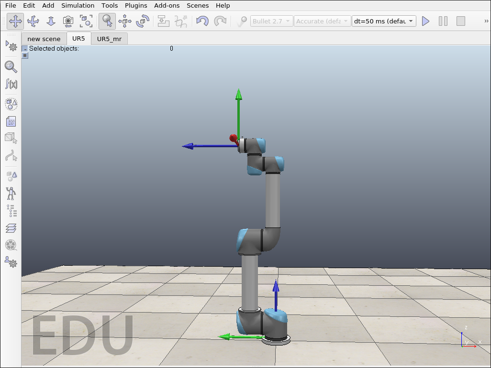
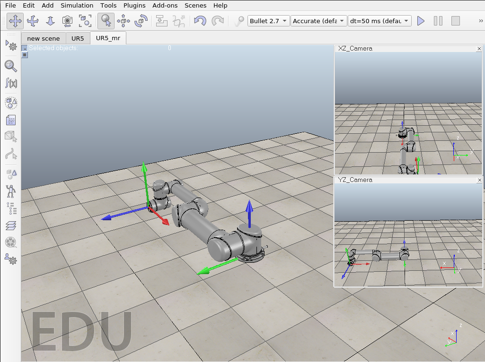

# Numerical Inverse Kinematics for UR5
The following program solves the inverse kinematics problem for an open-chain serial robot (UR5) using the Newton-Raphson numerical method.

All equations and mathematical formulation are from Kevin Lynch's Moder Robotics book.

## Requirements
`Python 3.X` and `numpy`

`CoppeliaSim 4.X`

## Scripts description
`hw01_ik_ur5.py`: This script defines the geometric parameters (screw-axis, home configuration) of the UR5 robot for each of the Coppeliasim simulation scenes. In the main method these parameters are used to solve the inverse kinematics with the Newton-Raphson method, execute the movement in the simulation and retrieve the final configuration

`sim.py`, `simCost,py`: Are the RemoteApi library from CoppeliaSim. This library needs the native-lib `remoteApi.*` witch deepens on the OS.

`ur5sim.py`: It is a class that simplifies the monitoring and control of the UR5 simulation in Coppeliam simulation. Work with scenes `UR5.ttt` and `UR5_mr.ttt`

`moderrobotics.py`: Contains the necessary methods from the modern robotics library. The complete library is [here](https://github.com/pydata/numexpr)

## Simulation scenes
In the `scenes` directory it contains two CoppeliaSim scenes with different UR5 settings.

`UR5.ttt`: This scene contains the original CoppeliaSim UR5 model with the spatial and body frames.

`UR5_mr.ttt`: This scene is a modification of the original provided by the modern robotics [wiki](http://hades.mech.northwestern.edu/index.php/CoppeliaSim_Introduction). The configuration of the UR5 is the same as in Kevin Lynch's book.

